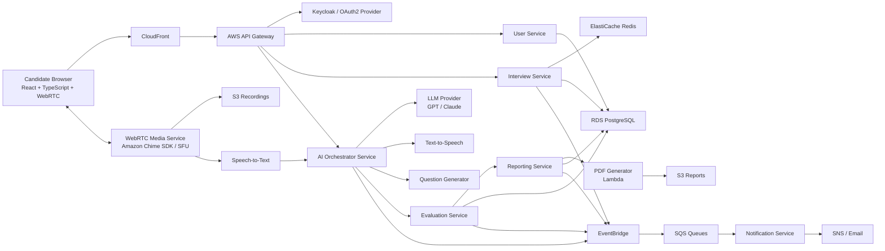
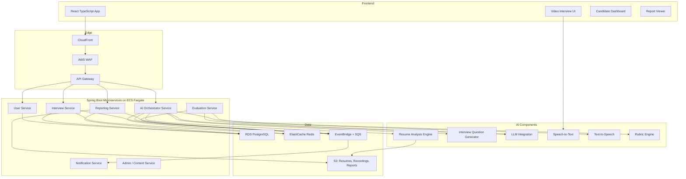
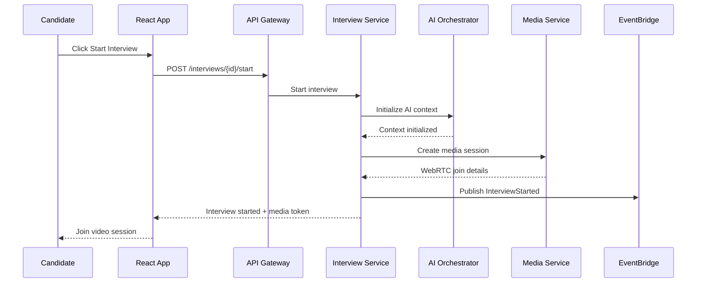
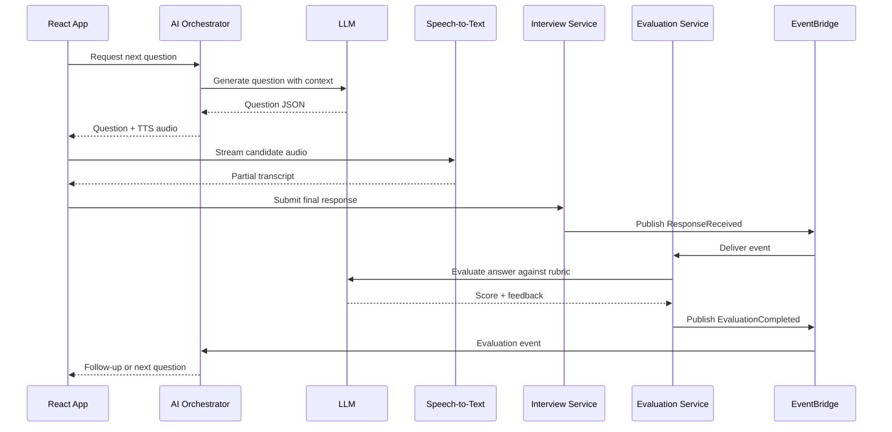
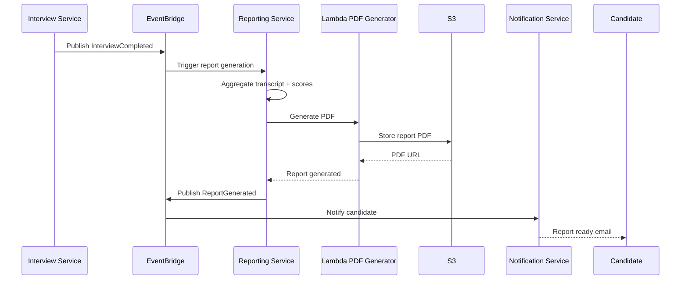
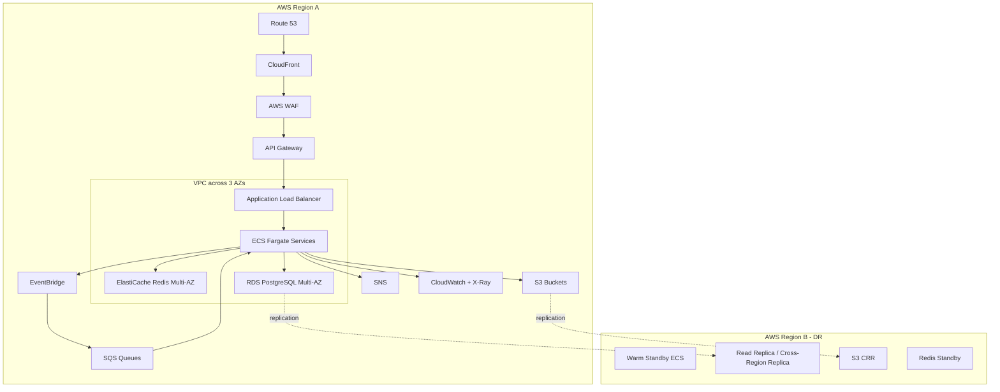
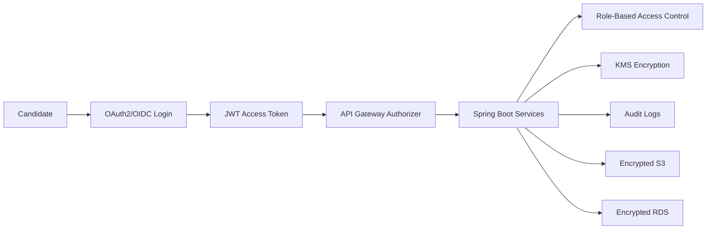

# AI-Powered Mock Video Interview Platform - System Design

## 1. Goal

Design a production-ready AI mock video interview platform that conducts technical, system design, behavioral, HR, and domain-specific interviews through browser-based video interaction. The AI interviewer should behave like a senior engineering manager or principal architect: asking role-specific questions, listening to candidate answers, asking contextual follow-ups, adapting difficulty, and generating a detailed evaluation report.

Scale targets:

- 100,000 registered users.
- 10,000 concurrent interviews.
- Multi-region AWS deployment.
- 99.99% uptime.
- Interview response latency under 2 seconds.
- Transcript generation under 5 seconds.

## 2. Business Capabilities

- Candidate registration and OAuth login.
- Candidate profile, resume upload, and skill selection.
- Technical, system design, behavioral, HR, and domain-specific interviews.
- Live AI-driven video interview session.
- Webcam and microphone-based responses.
- Real-time speech-to-text.
- AI-generated follow-up questions.
- Dynamic difficulty adjustment.
- Post-interview scorecard and recommendation.
- Historical report viewing.
- PDF report download.

## 3. High-Level Architecture Diagram



## 4. Detailed Component Diagram



## 5. Microservices

### 5.1 User Service

Responsibilities:

- Candidate registration and login.
- OAuth2/OIDC integration.
- JWT validation.
- Profile management.
- Resume upload metadata.
- Skill and target role management.

Main entities:

- Candidate
- CandidateProfile
- Resume
- Skill

### 5.2 Interview Service

Responsibilities:

- Create and manage interview sessions.
- Track interview status, timing, pause, resume, and completion.
- Store interview configuration.
- Maintain current question index and interview state.
- Publish interview lifecycle events.

Session states:

- Created
- Scheduled
- Started
- In Progress
- Paused
- Resumed
- Completed
- Failed
- Report Generated

### 5.3 AI Orchestrator Service

Responsibilities:

- Coordinates question generation, speech-to-text, LLM calls, text-to-speech, and follow-up logic.
- Maintains conversational context.
- Selects next question based on resume, skill stack, experience, previous answers, and difficulty.
- Calls LLM with controlled prompts and structured output schema.
- Applies guardrails to avoid hallucinated or inappropriate questions.

### 5.4 Evaluation Service

Responsibilities:

- Evaluates responses using rubrics and LLM analysis.
- Scores technical knowledge, architecture skills, coding skills, communication, confidence, leadership, and problem-solving.
- Produces overall recommendation: Strong Hire, Hire, Borderline, Reject.
- Stores model version and rubric version for auditability.

### 5.5 Reporting Service

Responsibilities:

- Builds final transcript, scorecard, strengths, weaknesses, and improvement plan.
- Generates downloadable PDF reports.
- Stores reports in S3.
- Exposes report history APIs.

### 5.6 Notification Service

Responsibilities:

- Sends email/SMS/push notifications.
- Notifies candidate when report is ready.
- Publishes reminders for scheduled interviews.
- Uses SNS, SES, or external email provider.

### 5.7 Admin / Content Service

Responsibilities:

- Manage question bank and rubric templates.
- Configure role-specific interview templates.
- Define skill maps for Java, Spring Boot, AWS, React, PostgreSQL, Kafka, Kubernetes, and System Design.
- Review AI-generated question quality.

## 6. Database Design

Use RDS PostgreSQL for transactional data. Use S3 for large objects such as resumes, audio/video recordings, and generated PDF reports. Use Redis for active interview session state and low-latency context.

### candidates

| Column | Type | Notes |
| --- | --- | --- |
| candidate_id | UUID | Primary key |
| email | VARCHAR(255) | Unique |
| full_name | VARCHAR(255) | Candidate name |
| auth_provider | VARCHAR(50) | Keycloak, Google, GitHub |
| external_subject | VARCHAR(255) | OAuth subject |
| status | VARCHAR(30) | Active, disabled, deleted |
| created_at | TIMESTAMP | Created time |
| updated_at | TIMESTAMP | Updated time |

### candidate_profiles

| Column | Type | Notes |
| --- | --- | --- |
| profile_id | UUID | Primary key |
| candidate_id | UUID | FK to candidates |
| target_role | VARCHAR(150) | Full Stack Developer, Architect |
| experience_years | INTEGER | Candidate experience |
| current_company | VARCHAR(150) | Optional |
| location | VARCHAR(100) | Optional |
| summary | TEXT | Profile summary |

### resumes

| Column | Type | Notes |
| --- | --- | --- |
| resume_id | UUID | Primary key |
| candidate_id | UUID | FK |
| file_url | VARCHAR(500) | S3 URL |
| parsed_text_url | VARCHAR(500) | S3 parsed text |
| extracted_skills | JSONB | AI extracted skills |
| uploaded_at | TIMESTAMP | Upload time |

### interviews

| Column | Type | Notes |
| --- | --- | --- |
| interview_id | UUID | Primary key |
| candidate_id | UUID | FK |
| interview_type | VARCHAR(50) | Technical, System Design, Behavioral, HR |
| target_role | VARCHAR(150) | Role selected |
| difficulty | VARCHAR(50) | Beginner, intermediate, senior, principal |
| duration_minutes | INTEGER | Planned duration |
| status | VARCHAR(50) | Created, started, paused, completed |
| started_at | TIMESTAMP | Start time |
| completed_at | TIMESTAMP | Completion time |
| overall_score | NUMERIC(5,2) | Final score |
| recommendation | VARCHAR(50) | Strong Hire, Hire, Borderline, Reject |

### interview_questions

| Column | Type | Notes |
| --- | --- | --- |
| question_id | UUID | Primary key |
| interview_id | UUID | FK |
| parent_question_id | UUID | For follow-up questions |
| sequence_no | INTEGER | Question order |
| question_text | TEXT | Asked question |
| skill_area | VARCHAR(100) | Java, AWS, System Design |
| difficulty | VARCHAR(50) | Current difficulty |
| expected_signals | JSONB | Concepts expected in answer |
| generated_by | VARCHAR(100) | LLM or question bank |
| created_at | TIMESTAMP | Created time |

### interview_responses

| Column | Type | Notes |
| --- | --- | --- |
| response_id | UUID | Primary key |
| interview_id | UUID | FK |
| question_id | UUID | FK |
| transcript | TEXT | Candidate answer |
| audio_url | VARCHAR(500) | S3 audio URL |
| video_url | VARCHAR(500) | S3 video URL |
| duration_seconds | INTEGER | Response duration |
| stt_confidence | NUMERIC(5,2) | Transcription confidence |
| inactivity_detected | BOOLEAN | Candidate inactive flag |
| created_at | TIMESTAMP | Response time |

### evaluations

| Column | Type | Notes |
| --- | --- | --- |
| evaluation_id | UUID | Primary key |
| interview_id | UUID | FK |
| response_id | UUID | Optional FK |
| technical_score | NUMERIC(5,2) | 0-100 |
| architecture_score | NUMERIC(5,2) | 0-100 |
| coding_score | NUMERIC(5,2) | 0-100 |
| communication_score | NUMERIC(5,2) | 0-100 |
| confidence_score | NUMERIC(5,2) | 0-100 |
| leadership_score | NUMERIC(5,2) | 0-100 |
| problem_solving_score | NUMERIC(5,2) | 0-100 |
| feedback_json | JSONB | Strengths, gaps, evidence |
| model_version | VARCHAR(100) | LLM/evaluator version |
| rubric_version | VARCHAR(100) | Rubric version |
| created_at | TIMESTAMP | Evaluation time |

### transcripts

| Column | Type | Notes |
| --- | --- | --- |
| transcript_id | UUID | Primary key |
| interview_id | UUID | FK |
| full_transcript | TEXT | Complete transcript |
| speaker_segments | JSONB | Candidate and AI segments |
| generated_at | TIMESTAMP | Generated time |

### reports

| Column | Type | Notes |
| --- | --- | --- |
| report_id | UUID | Primary key |
| interview_id | UUID | FK |
| report_json | JSONB | Structured report |
| pdf_url | VARCHAR(500) | S3 PDF URL |
| generated_at | TIMESTAMP | Generated time |

## 7. API Design

All APIs are exposed through API Gateway and secured with OAuth2/JWT.

### Candidate APIs

`POST /api/v1/candidates`

Registers candidate profile.

`GET /api/v1/candidates/me`

Returns candidate profile.

`PUT /api/v1/candidates/me/profile`

Updates candidate profile.

`POST /api/v1/candidates/me/resumes`

Uploads resume using pre-signed S3 URL.

### Interview APIs

`POST /api/v1/interviews`

```json
{
  "interviewType": "SYSTEM_DESIGN",
  "targetRole": "Principal Java Architect",
  "difficulty": "PRINCIPAL",
  "durationMinutes": 45,
  "skills": ["Java", "Spring Boot", "AWS", "Kafka", "PostgreSQL", "Kubernetes"],
  "resumeId": "resume-123"
}
```

`POST /api/v1/interviews/{interviewId}/start`

Starts interview and initializes AI context.

`POST /api/v1/interviews/{interviewId}/pause`

Pauses active interview.

`POST /api/v1/interviews/{interviewId}/resume`

Resumes paused interview.

`POST /api/v1/interviews/{interviewId}/responses`

```json
{
  "questionId": "question-123",
  "transcript": "I would design the service using event-driven architecture...",
  "durationSeconds": 145,
  "audioUrl": "s3://bucket/audio/file.webm",
  "videoUrl": "s3://bucket/video/file.webm"
}
```

`GET /api/v1/interviews/{interviewId}`

Gets interview status.

`GET /api/v1/interviews/history`

Gets candidate interview history.

### AI Interview APIs

`POST /api/v1/interviews/{interviewId}/questions/next`

Returns next question or follow-up.

```json
{
  "currentDifficulty": "SENIOR",
  "previousResponseId": "response-123",
  "remainingMinutes": 20
}
```

### Report APIs

`GET /api/v1/interviews/{interviewId}/report`

Returns structured report.

`GET /api/v1/interviews/{interviewId}/report/pdf`

Returns pre-signed PDF download URL.

## 8. Event-Driven Design

Use EventBridge for event routing and SQS for durable async processing.

### Events

| Event | Producer | Consumer |
| --- | --- | --- |
| InterviewStarted | Interview Service | AI Orchestrator, Notification Service |
| QuestionGenerated | AI Orchestrator | Interview Service |
| ResponseReceived | Interview Service | Evaluation Service, Transcript Processor |
| EvaluationCompleted | Evaluation Service | AI Orchestrator, Reporting Service |
| InterviewCompleted | Interview Service | Reporting Service |
| ReportGenerated | Reporting Service | Notification Service |
| RecordingStored | Media Service | Reporting Service |
| ResumeUploaded | User Service | Resume Analysis Engine |

### Event Example

```json
{
  "eventId": "evt-123",
  "eventType": "ResponseReceived",
  "version": "1.0",
  "timestamp": "2026-06-16T10:15:30Z",
  "source": "interview-service",
  "correlationId": "interview-789",
  "payload": {
    "interviewId": "interview-789",
    "questionId": "question-456",
    "responseId": "response-111",
    "candidateId": "candidate-222"
  }
}
```

## 9. Sequence Diagrams

### 9.1 Start Interview



### 9.2 Ask Question and Evaluate Response



### 9.3 Generate Report



## 10. AWS Deployment Architecture



## 11. Scaling Strategy

### Frontend

- Serve static React assets through CloudFront.
- Use regional edge caches.

### API and Services

- Deploy each Spring Boot microservice on ECS Fargate.
- Scale ECS services based on CPU, memory, request count, queue depth, and custom latency metrics.
- Separate AI Orchestrator and Evaluation Service because LLM calls have different latency and throughput patterns.

### Video and Media

- Use managed WebRTC infrastructure such as Amazon Chime SDK, Twilio, Daily, or an SFU cluster.
- Store recordings directly in S3 using multipart upload.
- Keep media path independent from business API path.

### Async Workloads

- Use SQS queues for evaluation retries, report generation, notifications, and resume parsing.
- Use dead-letter queues for failed events.

### Data

- Use RDS read replicas for reporting reads.
- Use Redis for active interview state and conversation context.
- Use S3 lifecycle policies for recordings.

### 10,000 Concurrent Interviews

- Split interviews by region using Route 53 latency routing.
- Use sharded Redis or Redis cluster for active session state.
- Pre-warm ECS capacity or use scheduled scaling around peak hiring hours.
- Apply LLM concurrency limits and fallback question bank when LLM rate limits are reached.

## 12. Security Architecture



Security controls:

- OAuth2/OIDC with Keycloak, Cognito, Google, GitHub, or enterprise SSO.
- JWT validation at API Gateway and service layer.
- RBAC roles: Candidate, Admin, Interview Reviewer, Support, Auditor.
- TLS for all network traffic.
- KMS encryption for RDS, S3, Redis, and secrets.
- AWS Secrets Manager for database credentials and LLM API keys.
- Pre-signed URLs for resume, recording, and PDF access.
- PII masking in logs.
- GDPR support: data export, right to delete, retention policies, consent tracking.
- WAF protection for API and frontend.
- Rate limiting per candidate and IP.
- Audit logs for report access, admin actions, and model/rubric changes.

## 13. AI Design

### Prompting Strategy

Use structured system prompts with:

- Interview type.
- Role and seniority.
- Resume summary.
- Selected skills.
- Difficulty.
- Previous answers.
- Expected rubric.
- Output schema.

### Guardrails

- Require JSON output from LLM.
- Validate generated questions against allowed topics.
- Block discriminatory, personal, medical, political, or legally sensitive questions.
- Keep feedback evidence-based by referencing transcript excerpts.
- Version all prompts and rubrics.

### Dynamic Difficulty

Difficulty increases when:

- Candidate gives complete and precise answers.
- Candidate handles follow-ups well.
- Candidate demonstrates senior-level trade-off thinking.

Difficulty decreases when:

- Candidate gives shallow answers.
- Candidate repeatedly misses fundamentals.
- Candidate is struggling with time or clarity.

### Evaluation Recommendation

| Score Range | Recommendation |
| --- | --- |
| 85-100 | Strong Hire |
| 70-84 | Hire |
| 55-69 | Borderline |
| 0-54 | Reject |

Recommendation should also consider red flags such as poor communication, inability to reason through follow-ups, or major technical inaccuracies.

## 14. Cost Optimization Strategy

- Use CloudFront caching for static frontend assets.
- Use S3 lifecycle rules to move old recordings to Glacier or delete after retention period.
- Store only audio if candidate opts out of video recording.
- Use async report generation instead of holding synchronous compute.
- Use smaller LLM models for simple HR or behavioral questions.
- Use larger models only for system design and senior technical evaluations.
- Cache resume analysis results.
- Reuse curated question bank when LLM generation is unnecessary.
- Batch non-urgent analytics and reporting jobs.
- Scale ECS services to zero or minimum for admin/report workers during off-hours.
- Use reserved capacity or savings plans for steady baseline workloads.

## 15. Disaster Recovery Strategy

RTO/RPO targets:

- RTO: 15-30 minutes for core interview platform.
- RPO: under 5 minutes for transactional data.

DR design:

- Multi-AZ RDS PostgreSQL in primary region.
- Cross-region read replica or Aurora Global Database for DR.
- S3 cross-region replication for resumes, recordings, and reports.
- ECS task definitions and infrastructure as code replicated across regions.
- Route 53 health checks and failover routing.
- EventBridge/SQS replay strategy for async events.
- Regular restore drills for RDS and S3.
- Backup retention policy aligned with compliance.

## 16. Sample Interview Flow

Scenario: Principal Java Architect interview.

1. Candidate logs in using OAuth.
2. Candidate uploads resume and selects System Design Interview.
3. Candidate chooses Java, Spring Boot, AWS, Kafka, PostgreSQL, Kubernetes, Redis, and Microservices.
4. Interview Service creates a 45-minute interview.
5. Resume Analysis Engine extracts candidate experience and relevant projects.
6. AI Orchestrator starts with an architecture question:
   "Design a scalable payment processing platform that supports real-time fraud checks and async settlement."
7. Candidate answers through webcam and microphone.
8. Speech-to-text streams transcript within a few seconds.
9. Evaluation Service scores architecture depth, trade-offs, scalability, security, and data consistency.
10. AI asks follow-up:
   "How would you guarantee idempotency across retries and duplicate payment events?"
11. Difficulty increases if candidate gives a strong answer.
12. Interview ends after duration or question limit.
13. Reporting Service generates transcript, scorecard, strengths, weaknesses, and PDF.
14. Candidate receives report-ready notification.

## 17. Technology Stack Justification

| Layer | Choice | Reason |
| --- | --- | --- |
| Frontend | React + TypeScript | Strong ecosystem, type safety, reusable interview UI |
| Video | WebRTC | Browser-native low-latency audio/video |
| Backend | Java 21 + Spring Boot | Enterprise-grade microservices, security, observability |
| Runtime | ECS Fargate | Managed container runtime with autoscaling |
| Auth | Keycloak / OAuth2 | Enterprise SSO, OIDC, RBAC support |
| Database | RDS PostgreSQL | Strong relational consistency for sessions and reports |
| Cache | ElastiCache Redis | Fast active session state and AI context |
| Events | EventBridge + SQS | Durable decoupled workflows and retry support |
| Storage | S3 | Scalable object storage for resumes, recordings, reports |
| CDN | CloudFront | Low-latency static asset and report delivery |
| AI | GPT/Claude + STT/TTS | Strong language reasoning and voice interaction |
| Observability | CloudWatch + X-Ray + OpenTelemetry | Metrics, traces, logs, service debugging |

## 18. Trade-Offs and Alternatives

### ECS Fargate vs EKS

ECS Fargate is simpler to operate and works well for independent Spring Boot services. EKS gives more Kubernetes flexibility, better for teams already standardized on Kubernetes, but adds operational complexity.

### EventBridge/SQS vs Kafka

EventBridge and SQS are AWS-managed and easier for serverless event routing, retries, and fanout. Kafka is better for high-throughput streaming, replay-heavy analytics, and event sourcing. For this platform, EventBridge/SQS is sufficient unless transcript and interaction streams become very high volume.

### Managed WebRTC vs Self-Hosted SFU

Managed providers reduce operational risk and scale faster. Self-hosted SFU can reduce long-term cost at high volume but requires deep media infrastructure expertise.

### LLM-Generated Questions vs Curated Question Bank

LLM generation gives personalization and adaptive follow-ups. Curated question banks are more controlled and cheaper. Best approach is hybrid: curated base questions plus LLM-generated follow-ups.

### Real-Time Evaluation vs Post-Interview Evaluation

Real-time evaluation enables adaptive follow-ups but increases latency and LLM cost. Post-interview evaluation is cheaper and more reliable but less interactive. Use lightweight real-time scoring during the interview and deeper evaluation after completion.

## 19. Production Readiness Checklist

### Architecture

- [ ] Microservices have clear ownership and APIs.
- [ ] Media path is separated from business API path.
- [ ] Async workflows use EventBridge/SQS with DLQs.
- [ ] Active interview state is stored in Redis with TTL.
- [ ] Reports and recordings are stored in S3.

### Reliability

- [ ] ECS services use autoscaling.
- [ ] RDS is Multi-AZ.
- [ ] SQS queues have dead-letter queues.
- [ ] LLM failures have fallback to curated questions.
- [ ] Report generation supports retry.
- [ ] Media connection failure has reconnect flow.

### Security

- [ ] OAuth2/OIDC authentication enabled.
- [ ] JWT validation at API and service layer.
- [ ] RBAC enforced.
- [ ] TLS enabled everywhere.
- [ ] S3, RDS, Redis encrypted.
- [ ] Secrets stored in Secrets Manager.
- [ ] PII masked in logs.
- [ ] GDPR delete/export workflow implemented.
- [ ] Recording consent captured.

### Observability

- [ ] Distributed tracing enabled.
- [ ] Interview latency metrics captured.
- [ ] STT, LLM, TTS latency tracked.
- [ ] Report generation time tracked.
- [ ] Error rates and DLQ depth alerted.
- [ ] Business metrics dashboard available.

### AI Quality

- [ ] Prompt templates versioned.
- [ ] Rubrics versioned.
- [ ] LLM outputs schema-validated.
- [ ] Evaluation includes evidence from transcript.
- [ ] Human review process for evaluation quality.
- [ ] Bias and fairness checks defined.

### Performance

- [ ] AI follow-up response under 2 seconds for common flows.
- [ ] Transcript generation under 5 seconds.
- [ ] Load test supports 10,000 concurrent interviews.
- [ ] Redis and DB connection pools sized.
- [ ] LLM provider rate limits handled.

## 20. Interview-Ready Summary

The platform uses React, TypeScript, and WebRTC for the candidate experience, backed by Java 21 Spring Boot microservices on ECS Fargate. The Interview Service manages session lifecycle, the AI Orchestrator coordinates resume analysis, question generation, speech-to-text, text-to-speech, and LLM follow-ups, while the Evaluation Service scores responses using structured rubrics. EventBridge and SQS decouple long-running workflows such as evaluation, report generation, notifications, and resume parsing. PostgreSQL stores transactional data, Redis stores active session context, and S3 stores resumes, recordings, transcripts, and PDF reports. The system scales horizontally across AWS regions, uses OAuth2/JWT/RBAC for security, encrypts data with KMS, supports GDPR deletion, and handles AI failures with curated fallback questions.

