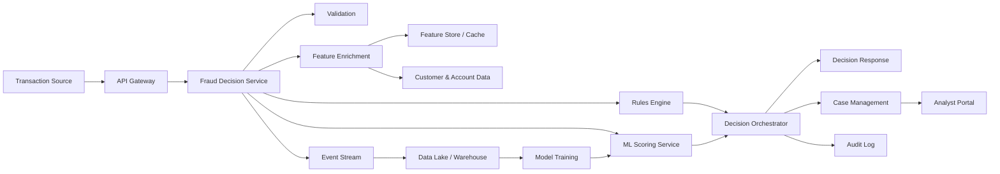
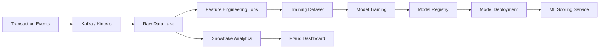

# Fraud Detection System Design

## 1. Objective

Design a real-time fraud detection system that evaluates financial transactions, identifies suspicious behavior, blocks or challenges high-risk activity, and gives fraud analysts a workflow to review cases.

The system should support:

- Real-time transaction risk scoring.
- Rule-based and machine-learning fraud detection.
- Case creation for suspicious transactions.
- Analyst review and decision tracking.
- Audit logs for compliance.
- Model monitoring and rule tuning.

## 2. Scope

### In Scope

- Transaction ingestion from payment, banking, or commerce systems.
- Risk scoring within low latency limits.
- Rules engine for deterministic fraud checks.
- ML model scoring for behavioral and anomaly detection.
- Decision outcomes: approve, decline, challenge, or review.
- Case management for fraud analysts.
- Dashboard for fraud metrics and operational health.
- Audit trail for every decision.

### Out of Scope

- Core payment processing.
- Customer onboarding and KYC, except as input signals.
- Manual chargeback processing.
- External law enforcement reporting workflows.

## 3. Key Requirements

### Functional Requirements

1. Accept transaction events from upstream systems.
2. Validate transaction payloads.
3. Enrich transactions with customer, device, account, location, velocity, and historical behavior signals.
4. Execute fraud rules.
5. Execute ML risk model scoring.
6. Combine rule and ML outputs into a final risk score.
7. Return a decision to the caller.
8. Create fraud cases for transactions requiring manual review.
9. Allow analysts to review, approve, reject, escalate, or mark transactions as fraud.
10. Store all decisions, evidence, scores, and analyst actions.
11. Generate reports for fraud rate, false positives, false negatives, and model drift.

### Non-Functional Requirements

- Real-time scoring latency: target under 200 ms for synchronous decisions.
- High availability: 99.9% or higher.
- Horizontal scalability for transaction spikes.
- Strong auditability and traceability.
- Secure handling of sensitive customer and payment data.
- Graceful fallback if the ML service is unavailable.
- Configurable rules without application redeployment.

## 4. High-Level Architecture



## 5. Core Components

### 5.1 API Gateway

Responsibilities:

- Authenticate upstream systems.
- Apply request throttling.
- Route transaction scoring requests.
- Capture request metadata.

Possible technologies:

- AWS API Gateway
- Kong
- NGINX
- Spring Cloud Gateway

### 5.2 Fraud Decision Service

Responsibilities:

- Main synchronous service for fraud decisions.
- Coordinates validation, enrichment, rules, ML scoring, and final decisioning.
- Returns decision to the caller.

Suggested implementation:

- Java Spring Boot service.
- Stateless and horizontally scalable.
- Deployed on ECS, EKS, or Kubernetes.

### 5.3 Feature Enrichment Service

Responsibilities:

- Build fraud features from raw transaction data.
- Fetch customer, device, merchant, account, and historical behavior signals.
- Calculate velocity features such as transaction count in last 5 minutes, amount in last 24 hours, failed attempts, and location changes.

Example features:

- Customer account age.
- Device reputation.
- IP geolocation risk.
- Merchant category risk.
- Transaction amount deviation from customer average.
- Number of transactions in recent time windows.
- Distance from last known transaction location.
- Failed login or OTP attempts.

Storage:

- Redis or DynamoDB for low-latency feature lookup.
- PostgreSQL for operational records.
- Snowflake or data lake for analytical history.

### 5.4 Rules Engine

Responsibilities:

- Run deterministic fraud rules.
- Support business-managed rule updates.
- Return rule hits and severity.

Example rules:

- Decline if card is reported stolen.
- Challenge if transaction amount is more than 5 times customer average.
- Review if customer has more than 5 failed login attempts in 10 minutes.
- Review if transaction country differs from billing country and device is new.
- Decline if merchant is blacklisted.

Rule output:

```json
{
  "ruleId": "HIGH_AMOUNT_NEW_DEVICE",
  "severity": "HIGH",
  "action": "REVIEW",
  "reason": "High-value transaction from a new device"
}
```

### 5.5 ML Scoring Service

Responsibilities:

- Score transaction fraud probability.
- Return model version, score, and top risk factors.
- Support model rollback.

Model options:

- Logistic regression for explainable baseline.
- Gradient boosted trees for tabular fraud signals.
- Isolation Forest or Autoencoder for anomaly detection.
- Graph-based model for account, device, card, and merchant relationships.

Output:

```json
{
  "modelVersion": "fraud-xgb-v12",
  "fraudProbability": 0.87,
  "riskBand": "HIGH",
  "topSignals": [
    "new_device",
    "high_amount_deviation",
    "unusual_location"
  ]
}
```

### 5.6 Decision Orchestrator

Responsibilities:

- Combine rule hits and ML score.
- Apply decision policy.
- Return final action.
- Create case when needed.

Decision examples:

| Condition | Decision |
| --- | --- |
| Blacklist rule hit | Decline |
| ML score >= 0.85 | Decline or Review |
| ML score 0.65-0.84 | Challenge |
| ML score 0.45-0.64 | Review |
| ML score < 0.45 and no severe rule hit | Approve |

Decision response:

```json
{
  "transactionId": "txn_123",
  "riskScore": 87,
  "decision": "REVIEW",
  "reasonCodes": [
    "HIGH_AMOUNT_NEW_DEVICE",
    "UNUSUAL_LOCATION"
  ],
  "modelVersion": "fraud-xgb-v12",
  "caseId": "case_789"
}
```

### 5.7 Case Management

Responsibilities:

- Create and assign review cases.
- Show transaction details, risk factors, rule hits, and history.
- Capture analyst decision.
- Feed confirmed fraud/non-fraud labels back into training data.

Case statuses:

- Open
- In Review
- Escalated
- Confirmed Fraud
- False Positive
- Approved
- Closed

### 5.8 Audit and Compliance

Responsibilities:

- Store immutable decision logs.
- Track who changed rules and when.
- Track analyst actions.
- Support compliance investigation.

Audit data:

- Request payload hash.
- Transaction ID.
- Score and decision.
- Rule versions.
- Model version.
- Analyst action.
- Timestamp.

## 6. Data Model

### transactions

| Column | Type | Notes |
| --- | --- | --- |
| transaction_id | UUID / VARCHAR | Primary key |
| customer_id | VARCHAR | Customer reference |
| account_id | VARCHAR | Account reference |
| amount | DECIMAL | Transaction amount |
| currency | VARCHAR | ISO currency |
| merchant_id | VARCHAR | Merchant reference |
| channel | VARCHAR | Web, mobile, ATM, POS |
| device_id | VARCHAR | Device fingerprint |
| ip_address | VARCHAR | Request IP |
| location | VARCHAR | Country/city/geohash |
| status | VARCHAR | Approved, declined, review |
| created_at | TIMESTAMP | Event time |

### fraud_decisions

| Column | Type | Notes |
| --- | --- | --- |
| decision_id | UUID | Primary key |
| transaction_id | VARCHAR | Transaction reference |
| risk_score | INTEGER | 0-100 score |
| decision | VARCHAR | Approve, decline, challenge, review |
| reason_codes | JSONB | Rule and model explanations |
| model_version | VARCHAR | ML model version |
| rule_version | VARCHAR | Ruleset version |
| created_at | TIMESTAMP | Decision time |

### fraud_cases

| Column | Type | Notes |
| --- | --- | --- |
| case_id | UUID | Primary key |
| transaction_id | VARCHAR | Transaction reference |
| assigned_to | VARCHAR | Analyst user ID |
| status | VARCHAR | Case status |
| priority | VARCHAR | Low, medium, high |
| analyst_decision | VARCHAR | Fraud, not fraud, needs escalation |
| notes | TEXT | Analyst notes |
| created_at | TIMESTAMP | Created time |
| updated_at | TIMESTAMP | Last update time |

### fraud_rules

| Column | Type | Notes |
| --- | --- | --- |
| rule_id | VARCHAR | Primary key |
| name | VARCHAR | Rule name |
| condition | JSONB | Rule expression |
| action | VARCHAR | Approve, decline, challenge, review |
| severity | VARCHAR | Low, medium, high |
| enabled | BOOLEAN | Active flag |
| version | INTEGER | Rule version |
| updated_by | VARCHAR | Admin user |
| updated_at | TIMESTAMP | Update time |

## 7. API Design

### Score Transaction

`POST /api/v1/fraud/score`

Request:

```json
{
  "transactionId": "txn_123",
  "customerId": "cust_456",
  "accountId": "acct_111",
  "amount": 1250.75,
  "currency": "USD",
  "merchantId": "merchant_999",
  "channel": "MOBILE",
  "deviceId": "device_abc",
  "ipAddress": "203.0.113.10",
  "timestamp": "2026-06-16T10:15:30Z"
}
```

Response:

```json
{
  "transactionId": "txn_123",
  "decision": "CHALLENGE",
  "riskScore": 72,
  "reasonCodes": [
    "NEW_DEVICE",
    "AMOUNT_ABOVE_NORMAL"
  ],
  "caseId": null
}
```

### Get Case

`GET /api/v1/fraud/cases/{caseId}`

### Update Case

`PATCH /api/v1/fraud/cases/{caseId}`

Request:

```json
{
  "status": "CONFIRMED_FRAUD",
  "notes": "Customer denied transaction.",
  "analystDecision": "FRAUD"
}
```

### Create or Update Rule

`POST /api/v1/fraud/rules`

## 8. Real-Time Scoring Flow

1. Transaction source sends a scoring request.
2. API Gateway authenticates and forwards request.
3. Fraud Decision Service validates payload.
4. Service enriches transaction with customer, device, merchant, account, and velocity features.
5. Rules Engine evaluates deterministic rules.
6. ML Scoring Service returns fraud probability.
7. Decision Orchestrator combines rules and model score.
8. System returns approve, decline, challenge, or review.
9. Decision and evidence are written to audit storage.
10. Review cases are created asynchronously when required.
11. Transaction event is published to the event stream for analytics and model training.

## 9. Batch and Analytics Flow



## 10. Technology Stack

### Backend

- Java 21
- Spring Boot
- Spring Security
- REST APIs
- Kafka or AWS Kinesis

### Data

- PostgreSQL for operational data.
- Redis for real-time feature cache.
- S3 data lake for raw events.
- Snowflake for analytics and reporting.

### ML

- Python model training pipeline.
- XGBoost, LightGBM, or scikit-learn.
- MLflow or SageMaker Model Registry.
- SageMaker endpoint, Kubernetes service, or dedicated model server.

### Cloud

- AWS API Gateway
- ECS/EKS
- RDS PostgreSQL
- ElastiCache Redis
- S3
- Kinesis/MSK
- CloudWatch
- IAM and KMS

### Frontend

- React analyst portal.
- Role-based access control.
- Dashboard and case queue.

## 11. Security Design

- Use OAuth2/OIDC for internal users.
- Use service-to-service authentication for transaction sources.
- Encrypt data in transit using TLS.
- Encrypt data at rest using KMS.
- Mask sensitive data in logs.
- Use least-privilege IAM permissions.
- Store secrets in AWS Secrets Manager.
- Apply role-based access for fraud analysts, admins, and auditors.
- Maintain immutable audit logs.

## 12. Reliability and Fallbacks

### ML Service Unavailable

- Continue with rules-only scoring.
- Add reason code `ML_SERVICE_UNAVAILABLE`.
- Send medium/high-risk transactions to review.
- Trigger alert.

### Feature Store Unavailable

- Use limited request-level features.
- Apply conservative rules.
- Route uncertain transactions to challenge or review.

### Case Management Unavailable

- Continue decisioning.
- Publish case creation event to retry queue.
- Alert operations team.

## 13. Observability

Metrics:

- Request count.
- Decision latency.
- Approval, decline, challenge, and review rates.
- Fraud detection rate.
- False positive rate.
- Model score distribution.
- Rule hit frequency.
- Case backlog.
- Analyst resolution time.

Logs:

- Transaction ID.
- Decision ID.
- Rule hits.
- Model version.
- Latency per component.
- Error details without sensitive data.

Alerts:

- ML scoring failure rate.
- High decision latency.
- Sudden increase in decline rate.
- Rule execution errors.
- Case backlog threshold crossed.
- Model drift detected.

## 14. Scalability Strategy

- Keep decision service stateless.
- Use horizontal autoscaling.
- Cache frequent features in Redis.
- Partition event streams by customer ID or account ID.
- Use asynchronous processing for audit, analytics, and case workflows.
- Store high-volume events in data lake rather than only operational DB.
- Use read replicas for analyst dashboard queries if needed.

## 15. Model Lifecycle

1. Collect transaction, decision, case, and chargeback data.
2. Label confirmed fraud and legitimate transactions.
3. Build training dataset.
4. Train and validate model.
5. Register model with version and metrics.
6. Deploy model in shadow mode.
7. Compare against current production model.
8. Roll out using canary deployment.
9. Monitor drift, false positives, and fraud capture rate.
10. Roll back if model quality degrades.

## 16. Analyst Portal Screens

- Fraud dashboard.
- Case queue.
- Case detail page.
- Transaction timeline.
- Customer risk profile.
- Rule management page.
- Model performance page.
- Audit log search.

## 17. Example Interview Answer Summary

A good fraud detection system should combine synchronous decisioning with asynchronous learning. The real-time path should validate and enrich transactions, execute deterministic rules, call an ML scoring service, and return approve, decline, challenge, or review within strict latency limits. Every decision should be auditable with rule versions, model versions, risk factors, and reason codes. Suspicious transactions should create analyst cases, and analyst outcomes should feed back into the model training pipeline. The system should be stateless, scalable, secure, observable, and resilient to ML or feature-store failures.

