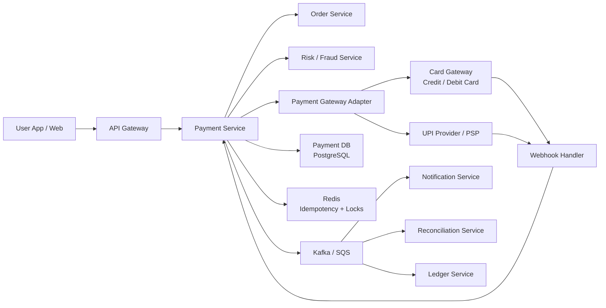
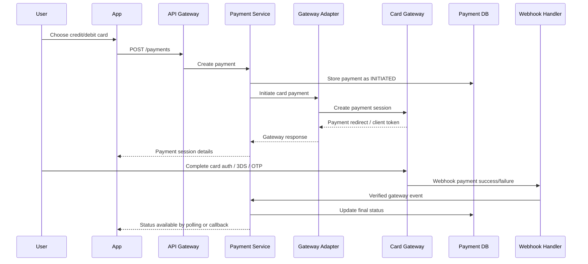
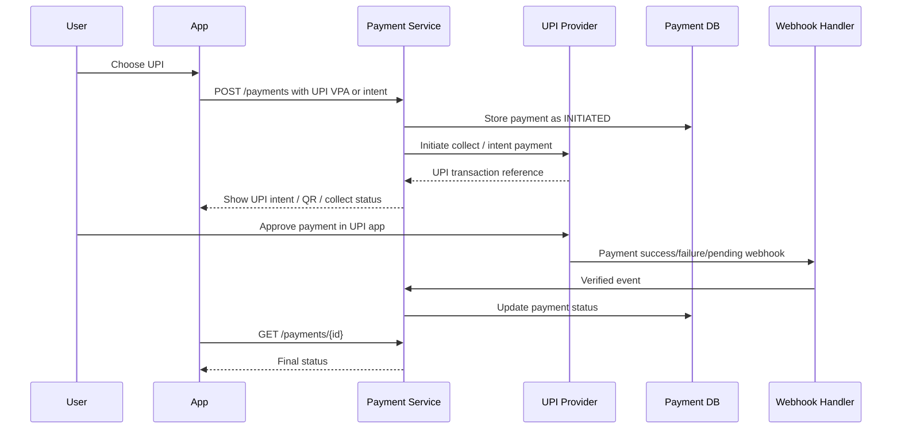
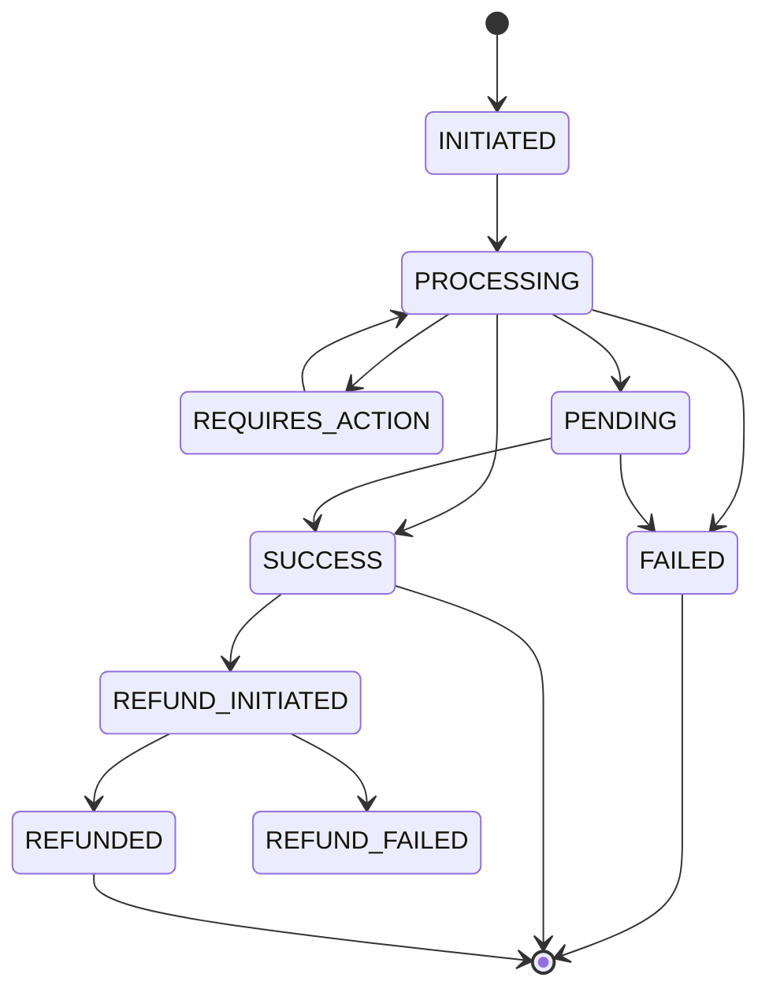

# Scalable Payment Service System Design

## 1. Goal

Design a scalable payment service that allows users to pay using:

- Credit card
- Debit card
- UPI

The system should support secure payment initiation, payment authorization, status tracking, retries, reconciliation, refunds, auditability, and integration with external payment gateways, banks, card networks, and UPI providers.

## 2. Requirements

### Functional Requirements

1. User can initiate payment for an order.
2. User can pay using credit card, debit card, or UPI.
3. System should create a payment transaction.
4. System should call payment gateway or UPI provider.
5. System should handle success, failure, pending, timeout, and cancelled states.
6. System should support webhooks from payment providers.
7. System should prevent duplicate charges.
8. System should support refunds.
9. System should support payment status lookup.
10. System should support reconciliation with gateway settlement reports.
11. System should maintain audit logs.

### Non-Functional Requirements

- High availability.
- Horizontal scalability.
- Low latency for payment initiation.
- Strong consistency for payment state.
- Idempotency for duplicate requests.
- Secure handling of sensitive payment data.
- PCI-DSS compliance for card flows.
- Observability and alerting.
- Disaster recovery.

## 3. High-Level Architecture



## 4. Core Services

### 4.1 Payment Service

Main orchestrator for payment lifecycle.

Responsibilities:

- Create payment transaction.
- Validate order and payable amount.
- Apply idempotency.
- Select payment method.
- Call payment gateway adapter.
- Store payment state.
- Expose payment status APIs.
- Publish payment events.

### 4.2 Payment Gateway Adapter

Abstracts external providers.

Responsibilities:

- Integrate with Razorpay, Stripe, Adyen, PayU, Cashfree, Paytm, PhonePe, NPCI/UPI PSP, or bank gateway.
- Normalize gateway responses.
- Handle provider-specific authentication.
- Support provider failover.

### 4.3 Webhook Handler

Receives asynchronous payment updates from gateway.

Responsibilities:

- Verify webhook signature.
- Deduplicate webhook events.
- Update transaction status.
- Publish payment success/failure events.

### 4.4 Reconciliation Service

Matches internal payments with gateway settlement files.

Responsibilities:

- Download settlement reports.
- Compare gateway records with internal transactions.
- Detect missing, duplicate, failed, or mismatched payments.
- Generate reconciliation reports.

### 4.5 Ledger Service

Maintains financial accounting entries.

Responsibilities:

- Create debit/credit ledger records.
- Ensure immutable financial history.
- Support settlement, refund, and adjustment entries.

## 5. Payment Flow

### 5.1 Card Payment Flow



### 5.2 UPI Payment Flow



## 6. Payment State Machine



Important states:

- `INITIATED`: payment request created.
- `PROCESSING`: gateway call in progress.
- `REQUIRES_ACTION`: card OTP, 3DS, or UPI approval needed.
- `PENDING`: provider has not confirmed final result.
- `SUCCESS`: payment completed.
- `FAILED`: payment failed.
- `REFUND_INITIATED`: refund requested.
- `REFUNDED`: refund completed.

## 7. Database Design

### payments

| Column | Type | Notes |
| --- | --- | --- |
| payment_id | UUID | Primary key |
| order_id | UUID | Order reference |
| user_id | UUID | User reference |
| amount | DECIMAL(18,2) | Payment amount |
| currency | VARCHAR(10) | INR, USD, etc. |
| status | VARCHAR(50) | INITIATED, SUCCESS, FAILED |
| payment_method | VARCHAR(30) | CREDIT_CARD, DEBIT_CARD, UPI |
| provider | VARCHAR(50) | Razorpay, Stripe, bank |
| provider_payment_id | VARCHAR(150) | Gateway payment ID |
| idempotency_key | VARCHAR(150) | Unique per request |
| failure_code | VARCHAR(100) | Optional |
| failure_reason | TEXT | Optional |
| created_at | TIMESTAMP | Created time |
| updated_at | TIMESTAMP | Updated time |

Unique constraints:

- `idempotency_key`
- `provider_payment_id`
- `order_id` where status is `SUCCESS`

### payment_attempts

| Column | Type | Notes |
| --- | --- | --- |
| attempt_id | UUID | Primary key |
| payment_id | UUID | FK |
| provider | VARCHAR(50) | Gateway |
| method | VARCHAR(30) | Card or UPI |
| status | VARCHAR(50) | Attempt status |
| request_payload_hash | VARCHAR(256) | Audit hash |
| response_payload | JSONB | Sanitized response |
| error_code | VARCHAR(100) | Optional |
| created_at | TIMESTAMP | Attempt time |

### payment_methods

| Column | Type | Notes |
| --- | --- | --- |
| method_id | UUID | Primary key |
| user_id | UUID | FK |
| method_type | VARCHAR(30) | CARD, UPI |
| token_reference | VARCHAR(255) | Gateway token, not raw card |
| card_brand | VARCHAR(50) | Visa, Mastercard, Rupay |
| card_last4 | VARCHAR(4) | Masked |
| upi_vpa_masked | VARCHAR(150) | Masked VPA |
| created_at | TIMESTAMP | Created time |

### refunds

| Column | Type | Notes |
| --- | --- | --- |
| refund_id | UUID | Primary key |
| payment_id | UUID | FK |
| amount | DECIMAL(18,2) | Refund amount |
| status | VARCHAR(50) | INITIATED, REFUNDED, FAILED |
| provider_refund_id | VARCHAR(150) | Gateway refund ID |
| reason | TEXT | Refund reason |
| created_at | TIMESTAMP | Created time |
| updated_at | TIMESTAMP | Updated time |

### webhook_events

| Column | Type | Notes |
| --- | --- | --- |
| event_id | UUID | Primary key |
| provider | VARCHAR(50) | Gateway |
| provider_event_id | VARCHAR(150) | Unique provider event |
| event_type | VARCHAR(100) | payment.success, payment.failed |
| payload | JSONB | Raw or sanitized payload |
| signature_valid | BOOLEAN | Signature result |
| processed | BOOLEAN | Processing status |
| received_at | TIMESTAMP | Received time |

## 8. API Design

### Create Payment

`POST /api/v1/payments`

Headers:

```http
Idempotency-Key: order_123_pay_001
Authorization: Bearer <jwt>
```

Request:

```json
{
  "orderId": "order-123",
  "amount": 1499.00,
  "currency": "INR",
  "paymentMethod": "UPI",
  "upi": {
    "vpa": "user@upi"
  }
}
```

Response:

```json
{
  "paymentId": "pay-123",
  "status": "REQUIRES_ACTION",
  "amount": 1499.00,
  "currency": "INR",
  "action": {
    "type": "UPI_COLLECT",
    "expiresInSeconds": 300
  }
}
```

### Get Payment Status

`GET /api/v1/payments/{paymentId}`

Response:

```json
{
  "paymentId": "pay-123",
  "orderId": "order-123",
  "status": "SUCCESS",
  "paymentMethod": "UPI",
  "providerPaymentId": "gateway-789"
}
```

### Refund Payment

`POST /api/v1/payments/{paymentId}/refunds`

Request:

```json
{
  "amount": 1499.00,
  "reason": "Customer cancelled order"
}
```

### Payment Webhook

`POST /api/v1/payments/webhooks/{provider}`

Used by external providers. Must verify signature before processing.

## 9. Idempotency and Duplicate Payment Prevention

Payment systems must handle retries safely because client apps, gateways, and networks can timeout.

Strategy:

1. Client sends `Idempotency-Key`.
2. Payment Service checks Redis and database for existing key.
3. If key exists, return existing payment response.
4. If key does not exist, create payment transaction.
5. Store idempotency key with payment ID.
6. Use database unique constraint to prevent duplicate success for same order.
7. Webhook processing also uses provider event ID for deduplication.

This prevents:

- Double clicking Pay button.
- Mobile retry after timeout.
- Gateway sending duplicate webhook.
- Order being paid twice.

## 10. Consistency and Transaction Handling

Payment state should be strongly consistent.

Use database transaction when:

- Creating payment.
- Updating payment status.
- Creating payment attempt.
- Creating ledger entry.

Use outbox pattern:

1. Update payment state in DB.
2. Insert event into `outbox_events` table in same transaction.
3. Background publisher sends event to Kafka/SQS.
4. Mark outbox event as published.

This avoids losing events after successful DB commit.

## 11. Event Design

Events:

- `PaymentInitiated`
- `PaymentProcessing`
- `PaymentRequiresAction`
- `PaymentSucceeded`
- `PaymentFailed`
- `PaymentPending`
- `RefundInitiated`
- `RefundSucceeded`
- `RefundFailed`

Example:

```json
{
  "eventId": "evt-123",
  "eventType": "PaymentSucceeded",
  "timestamp": "2026-06-16T10:15:30Z",
  "correlationId": "order-123",
  "payload": {
    "paymentId": "pay-123",
    "orderId": "order-123",
    "userId": "user-456",
    "amount": 1499.00,
    "currency": "INR",
    "method": "UPI"
  }
}
```

Consumers:

- Order Service marks order as paid.
- Notification Service sends receipt.
- Ledger Service creates accounting entry.
- Reconciliation Service tracks settlement.
- Fraud Service updates risk signals.

## 12. Security and Compliance

Card payments require strict compliance.

Security controls:

- Do not store raw card number, CVV, or PIN.
- Use payment gateway tokenization for saved cards.
- Use PCI-DSS compliant provider or hosted payment page.
- Use TLS everywhere.
- Encrypt data at rest.
- Use KMS-managed keys.
- Store secrets in Secrets Manager or Vault.
- Mask card number and UPI VPA in logs.
- Verify webhook signatures.
- Apply rate limiting.
- Use fraud checks for high-risk payments.
- Maintain audit logs.

For UPI:

- Do not log full VPA if avoidable.
- Verify callback signatures.
- Handle pending transactions carefully.
- Reconcile with provider reports.

## 13. Scaling Strategy

### API Layer

- Deploy Payment Service behind load balancer.
- Keep service stateless.
- Scale horizontally based on request rate, CPU, and latency.

### Database

- Use PostgreSQL primary for writes.
- Use read replicas for status lookup and dashboards.
- Partition large payment tables by month or created date.
- Index `payment_id`, `order_id`, `user_id`, `provider_payment_id`, and `idempotency_key`.

### Redis

- Store short-lived idempotency responses.
- Store distributed locks for payment creation per order.
- Use Redis cluster for scale.

### Messaging

- Use Kafka or SQS for async events.
- Use dead-letter queues for failed consumers.
- Make consumers idempotent.

### Provider Failover

- Configure multiple payment providers.
- Route traffic by method, success rate, cost, and latency.
- Use circuit breaker if one provider fails.

## 14. Failure Handling

### Client Timeout

User may not know payment result.

Solution:

- Return payment ID early.
- Allow status polling.
- Webhook updates final status.
- Reconciliation resolves stuck payments.

### Gateway Timeout

Payment Service calls gateway but response times out.

Solution:

- Mark payment as `PENDING`.
- Query gateway status asynchronously.
- Wait for webhook.
- Do not retry blindly with a new payment request.

### Duplicate Webhook

Gateway sends same webhook multiple times.

Solution:

- Store provider event ID.
- Ignore already processed events.

### UPI Pending

UPI payments can remain pending.

Solution:

- Keep status as `PENDING`.
- Poll provider status.
- Expire after configured time.
- Reconcile later.

### Payment Succeeded But Order Update Failed

Solution:

- Publish `PaymentSucceeded` through outbox.
- Order Service consumes event idempotently.
- Retry until order is updated.

## 15. Reconciliation

Reconciliation is mandatory in payment systems.

Daily process:

1. Download settlement file from gateway.
2. Parse gateway transactions.
3. Match by provider payment ID, amount, currency, and date.
4. Compare with internal payment records.
5. Flag mismatches.
6. Generate operations report.
7. Auto-fix safe cases or create manual review task.

Mismatch examples:

- Gateway success but internal failed.
- Internal success but no gateway settlement.
- Amount mismatch.
- Duplicate settlement.
- Refund not reflected.

## 16. Observability

Metrics:

- Payment initiation rate.
- Payment success rate.
- Payment failure rate.
- UPI pending rate.
- Gateway latency.
- Gateway error rate.
- Webhook processing lag.
- Reconciliation mismatch count.
- Refund success rate.

Logs:

- Payment ID.
- Order ID.
- Provider.
- Status transition.
- Error code.
- Correlation ID.

Alerts:

- Sudden drop in success rate.
- High UPI pending rate.
- Gateway timeout spike.
- Webhook failures.
- Reconciliation mismatch threshold crossed.
- Duplicate payment detected.

## 17. Technology Stack

| Layer | Choice |
| --- | --- |
| Backend | Java 21, Spring Boot |
| API | REST, API Gateway |
| Database | PostgreSQL |
| Cache | Redis |
| Messaging | Kafka or AWS SQS/SNS |
| Cloud | AWS ECS/EKS, RDS, ElastiCache, S3, CloudWatch |
| Security | OAuth2/JWT, KMS, Secrets Manager |
| Gateway | Razorpay, Stripe, Adyen, PayU, Cashfree, bank PSP |

## 18. Trade-Offs

### Single Gateway vs Multiple Gateways

Single gateway is simpler, but creates vendor dependency. Multiple gateways improve availability and cost optimization but add routing and reconciliation complexity.

### Synchronous vs Asynchronous Status

Synchronous response gives better user experience but cannot always guarantee final result. Webhooks and reconciliation are required for correctness.

### Store Payment Method vs One-Time Payment

Storing payment methods improves repeat payments but increases compliance and tokenization requirements. One-time payment is simpler and safer.

### Kafka vs SQS

Kafka is better for high-throughput event streams and replay. SQS is simpler and fully managed. For AWS-first architecture, SQS/SNS is often enough unless event volume and replay requirements are very high.

## 19. Production Readiness Checklist

- [ ] Idempotency implemented for payment creation.
- [ ] Duplicate webhook handling implemented.
- [ ] Webhook signature verification enabled.
- [ ] Database unique constraints prevent duplicate successful payments.
- [ ] Payment state machine enforced.
- [ ] Outbox pattern implemented for payment events.
- [ ] Gateway timeout handled as pending.
- [ ] UPI pending flow implemented.
- [ ] Refund flow implemented.
- [ ] Daily reconciliation implemented.
- [ ] No raw card data stored.
- [ ] Sensitive fields masked in logs.
- [ ] Metrics and alerts configured.
- [ ] Provider failover strategy defined.
- [ ] Load testing completed.
- [ ] Disaster recovery tested.

## 20. Interview-Ready Summary

A scalable payment service should treat payment as a state machine and should never assume a gateway response is final unless confirmed. The Payment Service creates transactions with idempotency keys, routes card and UPI requests through a Gateway Adapter, stores state in PostgreSQL, uses Redis for deduplication and locks, and publishes payment events asynchronously using an outbox pattern. Webhooks update final status, reconciliation catches mismatches, and downstream services such as Order, Ledger, Notification, and Fraud consume payment events idempotently. Security is critical: never store raw card data, tokenize payment methods, verify webhook signatures, encrypt sensitive data, and maintain audit logs.

